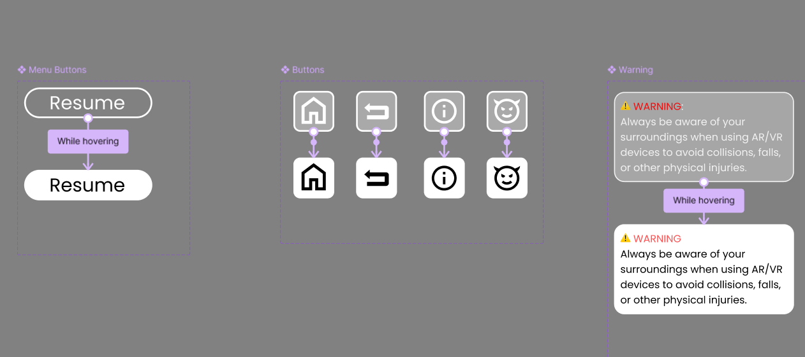

# AR/VR Home Menu UI Design

In this project, I used **Figma** to design a **futuristic and user-friendly home menu interface** for AR/VR environments. The focus was on **spatial interaction**, **accessibility**, and **intuitive navigation** to ensure an immersive user experience.

The design reflects **modern aesthetics**, clean structure, and smooth functionality—perfectly tailored for **mixed-reality platforms**.

## 🔧 Tools Used

- Figma

## 🌟 Key Features

- Spatial interaction support  
- Futuristic and immersive design  
- Easy and intuitive navigation  
- Accessibility-focused UI structure  

---

## 📱 Home Page

  

## 🧩 Components

  

